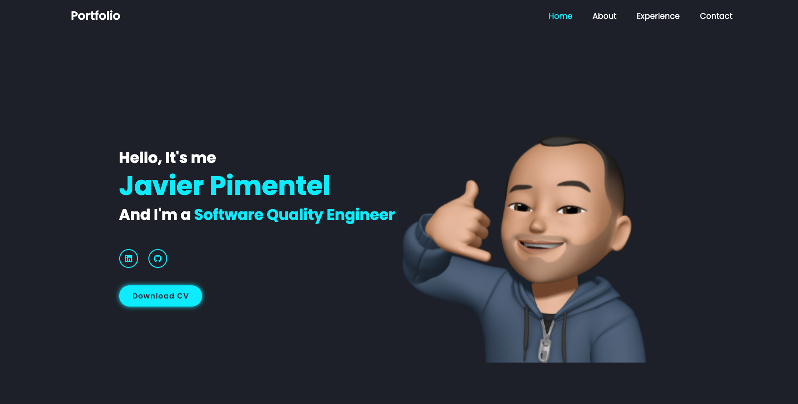
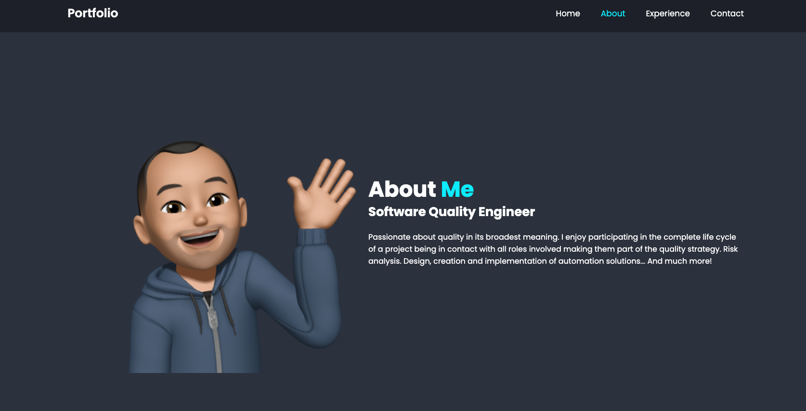
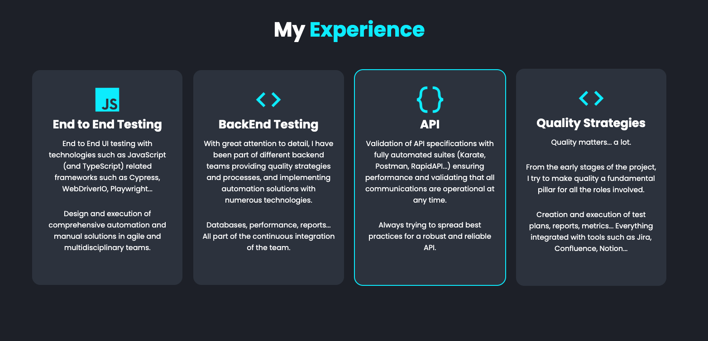
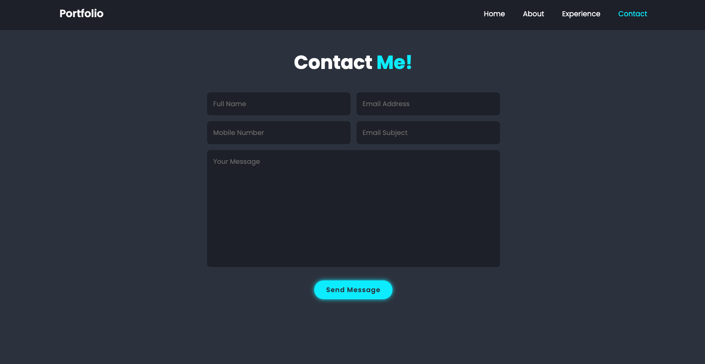

<h1 align="center">
   
   
  Javier Pimentel - Software Quality Engineer
   
</h1>

## Portfolio
Status: 

### Home

### About

### Experience

### Contact

## Credits

This software uses the following open source packages:

- [BoxIcons](https://boxicons.com)
- [Scrollrevealjs](https://scrollrevealjs.org/)
- [Codehal](https://www.buymeacoffee.com/codehalYoutube)

## License

MIT

---

> GitHub [@pimentelmugica](https://github.com/pimentelmugica) &nbsp;&middot;&nbsp;
